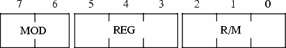
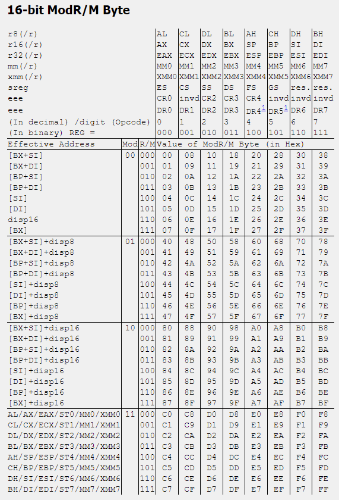
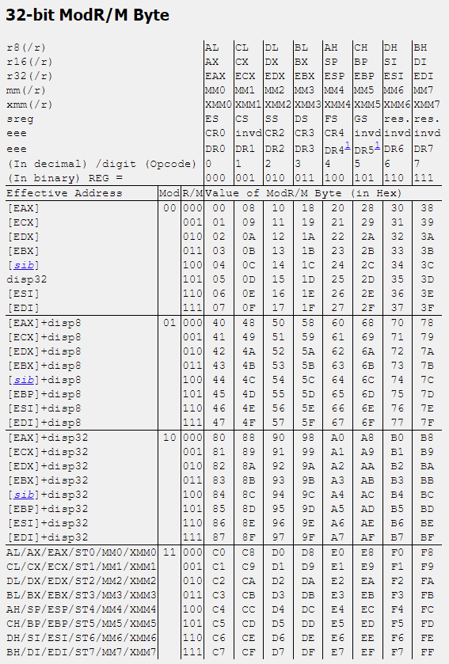

# Chapter 1 - Assembly and Disassembly

In this chapter we will be going over assembly and some basic disassembly. We will primarily be focusing on x86 in this chapter. 

## 1.1 Intro to Assembly

### 1.1.1 General Purpose Registers

Depending on the mode of operation there are going to be between 8 to 16 different available general purpose registers. Each of these registers is then divided into subregisters:

<style>

th {
    text-align: center;
    border: 1px solid black;
}

td {
 text-align: center;
 border: 1px solid black;
 width: 11%;
}

</style>


<center>
<table>
    <thead>
        <tr>
            <th>Register Encoding</th>
            <th colspan=4>Bits 32 - 63</th>
            <th colspan=2>Bits 16 - 31</th>
            <th>Bits 8 - 15</th>
            <th>Bits 0 - 7</th>
        </tr>
    </thead>
    <tbody>
        <tr>
            <td rowspan=4>0</td>
            <td colspan=8>RAX</td>
        </tr>
        <tr>
            <td></td>
            <td></td>
            <td></td>
            <td></td>
            <td colspan=4>EAX</td>
        </tr>
        <tr>
            <td></td>
            <td></td>
            <td></td>
            <td></td>
            <td></td>
            <td></td>
            <td colspan=2>AX</td>
        </tr>
        <tr>
            <td></td>
            <td></td>
            <td></td>
            <td></td>
            <td></td>
            <td></td>
            <td colspan=1>AH</td>
            <td colspan=1>AL</td>
        </tr>
        <tr>
            <td rowspan=4>3</td>
            <td colspan=8>RBX</td>
        </tr>
        <tr>
            <td></td>
            <td></td>
            <td></td>
            <td></td>
            <td colspan=4>EBX</td>
        </tr>
        <tr>
            <td></td>
            <td></td>
            <td></td>
            <td></td>
            <td></td>
            <td></td>
            <td colspan=2>BX</td>
        </tr>
        <tr>
            <td></td>
            <td></td>
            <td></td>
            <td></td>
            <td></td>
            <td></td>
            <td colspan=1>BH</td>
            <td colspan=1>BL</td>
        </tr>
        <tr>
            <td rowspan=4>1</td>
            <td colspan=8>RCX</td>
        </tr>
        <tr>
            <td></td>
            <td></td>
            <td></td>
            <td></td>
            <td colspan=4>ECX</td>
        </tr>
        <tr>
            <td></td>
            <td></td>
            <td></td>
            <td></td>
            <td></td>
            <td></td>
            <td colspan=2>CX</td>
        </tr>
        <tr>
            <td></td>
            <td></td>
            <td></td>
            <td></td>
            <td></td>
            <td></td>
            <td colspan=1>CH</td>
            <td colspan=1>CL</td>
        </tr>
        <tr>
            <td rowspan=4>2</td>
            <td colspan=8>RDX</td>
        </tr>
        <tr>
            <td></td>
            <td></td>
            <td></td>
            <td></td>
            <td colspan=4>EDX</td>
        </tr>
        <tr>
            <td></td>
            <td></td>
            <td></td>
            <td></td>
            <td></td>
            <td></td>
            <td colspan=2>DX</td>
        </tr>
        <tr>
            <td></td>
            <td></td>
            <td></td>
            <td></td>
            <td></td>
            <td></td>
            <td colspan=1>DH</td>
            <td colspan=1>DL</td>
        </tr>
        <tr>
            <td rowspan=4>6</td>
            <td colspan=8>RSI</td>
        </tr>
        <tr>
            <td></td>
            <td></td>
            <td></td>
            <td></td>
            <td colspan=4>ESI</td>
        </tr>
        <tr>
            <td></td>
            <td></td>
            <td></td>
            <td></td>
            <td></td>
            <td></td>
            <td colspan=2>SI</td>
        </tr>
        <tr>
            <td colspan=7></td>
            <td colspan=1>SIL</td>
        </tr>
        <tr>
            <td rowspan=4>7</td>
            <td colspan=8>RDI</td>
        </tr>
        <tr>
            <td></td>
            <td></td>
            <td></td>
            <td></td>
            <td colspan=4>EDI</td>
        </tr>
        <tr>
            <td></td>
            <td></td>
            <td></td>
            <td></td>
            <td></td>
            <td></td>
            <td colspan=2>DI</td>
        </tr>
        <tr>
            <td></td>
            <td></td>
            <td></td>
            <td></td>
            <td></td>
            <td></td>
            <td></td>
            <td colspan=1>DIL</td>
        </tr>
        <tr>
            <td rowspan=4>5</td>
            <td colspan=8>RBP</td>
        </tr>
        <tr>
            <td></td>
            <td></td>
            <td></td>
            <td></td>
            <td colspan=4>EBP</td>
        </tr>
        <tr>
            <td></td>
            <td></td>
            <td></td>
            <td></td>
            <td></td>
            <td></td>
            <td colspan=2>BP</td>
        </tr>
        <tr>
            <td></td>
            <td></td>
            <td></td>
            <td></td>
            <td></td>
            <td></td>
            <td></td>
            <td colspan=1>BPL</td>
        </tr>
        <tr>
            <td rowspan=4>4</td>
            <td colspan=8>RSP</td>
        </tr>
        <tr>
            <td></td>
            <td></td>
            <td></td>
            <td></td>
            <td colspan=4>ESP</td>
        </tr>
        <tr>
            <td></td>
            <td></td>
            <td></td>
            <td></td>
            <td></td>
            <td></td>
            <td colspan=2>SP</td>
        </tr>
        <tr>
            <td></td>
            <td></td>
            <td></td>
            <td></td>
            <td></td>
            <td></td>
            <td></td>
            <td colspan=1>SPL</td>
        </tr>
        <tr>
            <td rowspan=4>8</td>
            <td colspan=8>R8</td>
        </tr>
        <tr>
            <td></td>
            <td></td>
            <td></td>
            <td></td>
            <td colspan=4>R8D</td>
        </tr>
        <tr>
            <td></td>
            <td></td>
            <td></td>
            <td></td>
            <td></td>
            <td></td>
            <td colspan=2>R8W</td>
        </tr>
        <tr>
            <td></td>
            <td></td>
            <td></td>
            <td></td>
            <td></td>
            <td></td>
            <td></td>
            <td colspan=1>R8B</td>
        </tr>
        <tr>
            <td rowspan=4>9</td>
            <td colspan=8>R9</td>
        </tr>
        <tr>
            <td></td>
            <td></td>
            <td></td>
            <td></td>
            <td colspan=4>R9D</td>
        </tr>
        <tr>
            <td></td>
            <td></td>
            <td></td>
            <td></td>
            <td></td>
            <td></td>
            <td colspan=2>R9W</td>
        </tr>
        <tr>
            <td></td>
            <td></td>
            <td></td>
            <td></td>
            <td></td>
            <td></td>
            <td></td>
            <td colspan=1>R9B</td>
        </tr>
        <tr>
            <td rowspan=4>10</td>
            <td colspan=8>R10</td>
        </tr>
        <tr>
            <td></td>
            <td></td>
            <td></td>
            <td></td>
            <td colspan=4>R10D</td>
        </tr>
        <tr>
            <td></td>
            <td></td>
            <td></td>
            <td></td>
            <td></td>
            <td></td>
            <td colspan=2>R10W</td>
        </tr>
        <tr>
            <td></td>
            <td></td>
            <td></td>
            <td></td>
            <td></td>
            <td></td>
            <td></td>
            <td colspan=1>R10B</td>
        </tr>
        <tr>
            <td rowspan=4>11</td>
            <td colspan=8>R11</td>
        </tr>
        <tr>
            <td></td>
            <td></td>
            <td></td>
            <td></td>
            <td colspan=4>R11D</td>
        </tr>
        <tr>
            <td></td>
            <td></td>
            <td></td>
            <td></td>
            <td></td>
            <td></td>
            <td colspan=2>R11W</td>
        </tr>
        <tr>
            <td></td>
            <td></td>
            <td></td>
            <td></td>
            <td></td>
            <td></td>
            <td></td>
            <td colspan=1>R11B</td>
        </tr>
        <tr>
            <td rowspan=4>12</td>
            <td colspan=8>R12</td>
        </tr>
        <tr>
            <td></td>
            <td></td>
            <td></td>
            <td></td>
            <td colspan=4>R12D</td>
        </tr>
        <tr>
            <td></td>
            <td></td>
            <td></td>
            <td></td>
            <td></td>
            <td></td>
            <td colspan=2>R12W</td>
        </tr>
        <tr>
            <td></td>
            <td></td>
            <td></td>
            <td></td>
            <td></td>
            <td></td>
            <td></td>
            <td colspan=1>R12B</td>
        </tr>
        <tr>
            <td rowspan=4>13</td>
            <td colspan=8>R13</td>
        </tr>
        <tr>
            <td></td>
            <td></td>
            <td></td>
            <td></td>
            <td colspan=4>R13D</td>
        </tr>
        <tr>
            <td></td>
            <td></td>
            <td></td>
            <td></td>
            <td></td>
            <td></td>
            <td colspan=2>R13W</td>
        </tr>
        <tr>
            <td></td>
            <td></td>
            <td></td>
            <td></td>
            <td></td>
            <td></td>
            <td></td>
            <td colspan=1>R13B</td>
        </tr>
        <tr>
            <td rowspan=4>14</td>
            <td colspan=8>R14</td>
        </tr>
        <tr>
            <td></td>
            <td></td>
            <td></td>
            <td></td>
            <td colspan=4>R14D</td>
        </tr>
        <tr>
            <td></td>
            <td></td>
            <td></td>
            <td></td>
            <td></td>
            <td></td>
            <td colspan=2>R14W</td>
        </tr>
        <tr>
            <td></td>
            <td></td>
            <td></td>
            <td></td>
            <td></td>
            <td></td>
            <td></td>
            <td colspan=1>R14B</td>
        </tr>
        <tr>
            <td rowspan=4>15</td>
            <td colspan=8>R15</td>
        </tr>
        <tr>
            <td></td>
            <td></td>
            <td></td>
            <td></td>
            <td colspan=4>R15D</td>
        </tr>
        <tr>
            <td></td>
            <td></td>
            <td></td>
            <td></td>
            <td></td>
            <td></td>
            <td colspan=2>R15W</td>
        </tr>
        <tr>
            <td></td>
            <td></td>
            <td></td>
            <td></td>
            <td></td>
            <td></td>
            <td></td>
            <td colspan=1>R15B</td>
        </tr>
    </tbody>
</table>

All R*, SIL, DIL, BPL, and SPL registers are only available in long mode. Registers AH, BH, CH, and DH cannot be used in instructions that are not valud outside the long mode.

</center>

### 1.1.2 Accumulators

The EAX register is known as an ***accumulator*** and is used with division and multiplication. It is used both as the implied and target operands. For multiplication this will look like:

| Operand Size | Source 1 | Source 2                       | Destination|
|:------------:|:--------:|:------------------------------:|:----------:|
|8 bits        |AL        |8 bit register or 8 bit memory  |AX          |
|16 bits       |AX        |16 bit register or 16 bit memory|DX:AX       |
|32 bits       |EAX       |32 bit register or 32 bit memory|EDX:EAX     |
|64 bits       |RAX       |64 bit register or 64 bit memory|RDX:RAX     |

For division we store the quotient and remainder:

| Operand Size | Dividend | Divisor                        | Quotient   | Remainder |
|:------------:|:--------:|:------------------------------:|:----------:|:---------:|
|8/16 bits     |AX        |8 bit register or 8 bit memory  |AL          |AH         |
|16/32 bits    |DX:AX     |16 bit register or 16 bit memory|AX          |DX         |
|32/64 bits    |EDX:EAX   |32 bit register or 32 bit memory|EAX         |EDX        |
|64/128 bits   |RDX:RAX   |64 bit register or 64 bit memory|RAX         |RDX        |

### 1.1.3 Counter

The ECX register is also known as the counter register. This register is used in loops as a loop iteration counter. This register's least significnt part, CL, is also often used in bitwise shift operations where it contains the number of bits to be shifted.

### 1.1.4 Stack Pointer

The ESP register is the stack pointer, this register together with the SS register describe the stack area of a thread. SS contains the descriptor of the stack segment and ESP is the index that points to the current position within the stack.

### 1.1.5 Source and Destination Indices

The ESI and EDI registers are the source and destination index registers used in string operations. ESI contains the source address and EDI contains the destination address.

### 1.1.6 Base Pointer

The EBP register is called the base pointer and its most common use is to point to the base of the stack frame during function calls. 

### 1.1.7 EFlags Register

The EFlags register lets us get information about the last operation performed. Everything from overflow in multiplication / division, to carry in subtraction.

#### Bit 0 - Carry Flag

The carry flag is mostly used for the detected of carrying or borrowing in arithmetic operations and is set if the bit width result of the last such operation exceeds the width of the ALU (arithmetic logic unit).

#### Bit 2 - Parity Flag

The parity flag is set to 1 in case the number of 1s in the least significant byte is even; otherwise the flag is set to 0.

#### Bit 4 - Adjust Flag

The adjust flag signals when a carry or borrow occurred in the four least significant bits and is primarily used with binary coded decimal arithmetics.

#### Bit 6 - Zero Flag

The zero flag is set when the result of an arithmetic or bitwise operation is 0. This includes operations that do not store the result (comparison or test). 

#### Bit 7 - Sign Flag

The sign flag is set when the last mathematical operation resulted in a negative number.

#### Bit 8 - Trap Flag

The trap flag causes a single step interrupt after every executed instruction.

#### Bit 9 - Interrupt Enable Flag

The interrupt enable flag defines whether the processor will or will not react to incoming interrupts.

#### Bit 10 - Direction Flag

The direction flag controls the direction of string operations. An operation is performed from the lower address to the higher address if the flag is reset (0) or from the higher address to the lower address if the flag is set (1).

#### Bit 11 - Overflow Flag

The overflow flag is set when the result of the operation is either too small or too big a number to fit into the destination operand.  

### 1.1.8 Different Types of Jumps

Assembly uses many different types of jumps, these normally reference some sort of flag, here is a table of all the jumps and what they check:

|Instruction    |Description                 |Signed-ness    |Flags               |
|:-------------:|:-------------------------: |:-------------:|:------------------:|
|JO             |Jump if overflow            |               | OF == 1            |
|JNO            |Jump if not overflow        |               | OF == 0            |
|JS             |Jump if sign                |               | SF == 1            |
|JNS            |Jump if not sign            |               | SF == 0            |
|JE             |Jump if equal               |               | ZF == 1            |
|JZ             |Jump if zero                |               | ZF == 1            |
|JNE            |Jump if not equal           |               | ZF == 0            |
|JNZ            |Jump if not zero            |               | ZF == 0            |
|JB             |Jump if below               | Unsigned      | CF == 1            |
|JNAE           |Jump if not above or equal  | Unsigned      | CF == 1            |
|JC             |Jump if carry               | Unsigned      | CF == 1            |
|JNB            |Jump if not below           | Unsigned      | CF == 0            |
|JAE            |Jump if above or equal      | Unsigned      | CF == 0            |
|JNC            |Jump if not carry           | Unsigned      | CF == 0            |
|JBE            |Jump if below or equal      | Unsigned      | CF == 1 Or ZF == 1 |
|JNA            |Jump if not above           | Unsigned      | CF == 1 Or ZF == 1 |
|JA             |Jump if above               | Unsigned      | CF == 0 Or ZF == 0 |
|JNBE           |Jump if not below or equal  | Unsigned      | CF == 0 Or ZF == 0 |
|JL             |Jump if less                | Signed        | SF != OF           |
|JNGE           |Jump if not greater or equal| Signed        | SF != OF           |
|JGE            |Jump if greater or equal    | Signed        | SF == OF           |
|JNL            |Jump if not less            | Signed        | SF == OF           |
|JLE            |Jump if less or equal       | Signed        | ZF == 1 OR SF != OF|
|JNG            |Jump if not greater         | Signed        | ZF == 1 OR SF != OF|
|JG             |Jump if greater             | Signed        | ZF == 0 OR SF == OF|
|JNLE           |Jump if not less or equal   | Signed        | ZF == 0 OR SF == OF|
|JP             |Jump if parity              |               | PF == 1            |
|JPE            |Jump if parity even         |               | PF == 1            |
|JNP            |Jump if not parity          |               | PF == 0            |
|JPO            |Jump if parity odd          |               | PF == 0            |
|JCXZ           |Jump if CX register is 0    |               | CX == 0            |
|JECXZ          |Jump if ECX register is 0   |               | ECX == 0           |

### 1.1.9 Push and Pop

Instead of using registers we can also use the stack to save and access variables. The two most common variables used for this are:

***Push***: Instructs the processor to store the value of the oprand onto a stack and decrements the stack pointer.

and 

***POP***: Retrives values stored on the stack. Operand for this instruction is the destination where the value should be stored. The instruction also increments the stack pointer.

These two commands are most often seen being used to save registers for function calls:

```
 push ebx ; save EBX register on stack

 ; Make changes to EBX register
 
 pop ebx ; restore EBX register from stack
```

## 1.2 Opcodes

### 1.2.1 What are opcodes?

Opcodes are our programs operation codes and are all 1 byte in size, these instructions then have between 1 to 4 bytes for operands available.

### 1.2.2 Opcode Table

In most cases an instruction can be split into several different opcodes. This allows us to do instructions for different sized data as well as instructions based on certain registers. 

Other opcodes can however represent several different instructions based on it's operands, such as the D1 opcode which can represent ROL, ROR, RCL, RCR, SHL, SAL, SHR, SAL, SHL, and SAR.

To look up all of the codes for x86 you can use the following site: http://ref.x86asm.net/coder32.html. 

### 1.2.3 MOD-REG-R/M Byte

x86 uses the MOD-REG-R/M Byte in order to encode multiple registers into one single byte. This byte is segmented into three sections: the mod section (high 2 bits), the reg section (next 3 bits), and then the r/m section (final 3 bits).

<center>



</center>

Using these values as well as the size of the data we can get all register combinations within one byte:

<center>





</center>