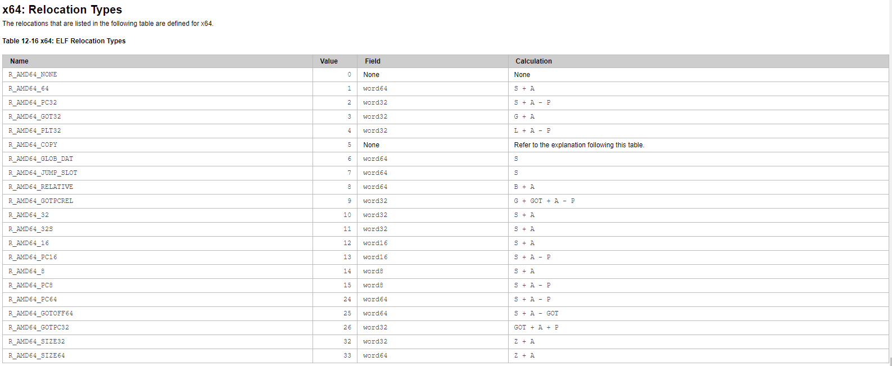

# Chapter 2 - Files

## 2.1 What does a file need to run?

This chapter will be discussing how a file is loaded into memory and run as well as what is required for a file to run. We will be using the elf file format as an example.

## 2.2 ELF File Structure

### 2.2.1 Dissection of the ELF file structure

The ELF file, otherwise known as Executable and Linkable Format, is a common standard file format for executabl files, object code, shared libraries, and core dumps. This will be what you see most of the time when using linux.

In an elf file you will have the main ELF header, the program header table which describes zero or more memory segments, the section header table which describes zero or more sections, and then the data referred to by the tables.


<style>
th {
    text-align: center;
    border-bottom: none;
}

td {
    text-align: center;
    border: 1px black solid;
}

table {
    margin: auto;
}
</style>

<center>

***ELF Header***

<table>
    <thead>
        <tr>
            <th colspan=2>Offset</th>
            <th colspan=2>Size in Bytes</th>
            <th rowspan=2>Field</th>
            <th rowspan=2>Purpose</th>
        </tr>
        <tr>
            <th>32-bit</th>
            <th>64-bit</th>
            <th>32-bit</th>
            <th>64-bit</th>
        </tr>
    </thead>
    <tbody>
        <tr>
            <td colspan=2>0x00</td>
            <td colspan=2>4</td>
            <td>e_ident[EI_MAG0] through e_ident[EI_MAG3]</td>
            <td>0x7F followed by ELF(45 4c 46) in ASCII; these four bytes constitute the magic number.</td>
        </tr>
        <tr>
            <td colspan=2>0x04</td>
            <td colspan=2>1</td>
            <td>e_ident[EI_CLASS]</td>
            <td>This byte is set to either 1 or 2 to signify 32- or 64-bit format, respectively.</td>
        </tr>
        <tr>
            <td colspan=2>0x05</td>
            <td colspan=2>1</td>
            <td>e_ident[EI_DATA]</td>
            <td>This byte is set to either 1 or 2 to signify little or big endianness, respectively. This affects interpretation of multi-byte fields starting with offset 0x10.</td>
        </tr>
        <tr>
            <td colspan="2">0x06</td>
            <td colspan="2">1</td>
            <td>e_ident[EI_VERSION]</span>
            </td>
            <td>Set to 1 for the original and current version of ELF.
            </td>
        </tr>
        <tr>
            <td colspan=2>0x07</td>
            <td colspan=2>1</td>
            <td>e_ident[EI_OSABI]</td>
            <td>Identifies the target operating system application binary interface. The ABI is an interface between two binary program modules and defines how data structures or computationaltourtines are accessed in machine code. Often set to 0 regardless of platform.</td>
        </tr>
        <tr>
            <td colspan=2>0x08</td>
            <td colspan=2>1</td>
            <td>e_ident[EI_ABIVERSION]</td>
            <td>Further specifies the ABI version. Its interpretation depends on the target ABI.</td>
        </tr>
        <tr>
            <td colspan=2>0x09</td>
            <td colspan=2>7</td>
            <td>e_ident[EI_PAD]</td>
            <td>Unused and filled with zeroes.</td>
        </tr>
        <tr>
            <td colspan=2>0x10</td>
            <td colspan=2>2</td>
            <td>e_type</td>
            <td>Identifies the object file type.<br><table class="wikitable">
            <center>
            <tbody><tr>
            <th>Value</th>
            <th>Type
            </th></tr>
            <tr>
            <td>0x00</td>
            <td>ET_NONE
            </td></tr>
            <tr>
            <td>0x01</td>
            <td>ET_REL
            </td></tr>
            <tr>
            <td>0x02</td>
            <td>ET_EXEC
            </td></tr>
            <tr>
            <td>0x03</td>
            <td>ET_DYN
            </td></tr>
            <tr>
            <td>0x04</td>
            <td>ET_CORE
            </td></tr>
            <tr>
            <td>0xFE00</td>
            <td>ET_LOOS
            </td></tr>
            <tr>
            <td>0xFEFF</td>
            <td>ET_HIOS
            </td></tr>
            <tr>
            <td>0xFF00</td>
            <td>ET_LOPROC
            </td></tr>
            <tr>
            <td>0xFFFF</td>
            <td>ET_HIPROC
            </td></tr></tbody></table>
            </center>
            </td>
        </tr>
        <tr>
            <td colspan=2>0x12</td>
            <td colspan=2>2</td>
            <td>e_machine</td>
            <td>Specifies target instruction set architecture.</td>
        </tr>
        <tr>
            <td colspan=2>0x14</td>
            <td colspan=2>4</td>
            <td>e_version</td>
            <td>Set to 1 for the original version of ELF.</td>
        </tr>
        <tr>
            <td colspan=2>0x18</td>
            <td>4</td>
            <td>8</td>
            <td>e_entry</td>
            <td>This is the memory address of the entry point from where the process starts executing.</td>
        </tr>
        <tr>
            <td>0x1C</td>
            <td>0x20</td>
            <td>4</td>
            <td>8</td>
            <td>e_phoff</td>
            <td>Points to the start of the program header table.</td>
        </tr>
        <tr>
            <td>0x20</td>
            <td>0x28</td>
            <td>4</td>
            <td>8</td>
            <td>e_shoff</td>
            <td>Points to the start of the section header table.</td>
        </tr>
        <tr>
            <td>0x24</td>
            <td>0x30</td>
            <td colspan=2>4</td>
            <td>e_flags</td>
            <td>Interpretation of this field depends on the target architecture.</td>
        </tr>
        <tr>
            <td>0x28</td>
            <td>0x34</td>
            <td colspan=2>2</td>
            <td>e_ehsize</td>
            <td>Contains the size of the header.</td>
        </tr>
        <tr>
            <td>0x2A</td>
            <td>0x36</td>
            <td colspan=2>2</td>
            <td>e_phentsize</td>
            <td>Contains the size of a program header table entry.</td>
        </tr>
        <tr>
            <td>0x2C</td>
            <td>0x38</td>
            <td colspan=2>2</td>
            <td>e_phnum</td>
            <td>Contains the number of entries in the program header table.</td>
        </tr>
        <tr>
            <td>0x2E</td>
            <td>0x3A</td>
            <td colspan=2>2</td>
            <td>e_shentsize</td>
            <td>Contains the size of a section header table entry.</td>
        </tr>
        <tr>
            <td>0x30</td>
            <td>0x3C</td>
            <td colspan=2>2</td>
            <td>e_shnum</td>
            <td>Contains the number of entries in the section header table.</td>
        </tr>
        <tr>
            <td>0x32</td>
            <td>0x3E</td>
            <td colspan=2>2</td>
            <td>e_shstrndx</td>
            <td>Contains index of the section header table entry that contains the section names.</td>
        </tr>
        <tr>
            <td>0x34</td>
            <td>0x40</td>
            <td colspan=3></td>
            <td>End of ELF Header.</td>
        </tr>
    </tbody>
</table>

</center>

<br><br>

<center>

***Program header table***

<table>
    <thead>
        <tr>
            <th colspan=2>Offset</th>
            <th colspan=2>Size in Bytes</th>
            <th rowspan=2>Field</th>
            <th rowspan=2>Purpose</th>
        </tr>
        <tr>
            <th>32-bit</th>
            <th>64-bit</th>
            <th>32-bit</th>
            <th>64-bit</th>
        </tr>
    </thead>
    <tbody>
        <tr>
            <td colspan=2>0x00</td>
            <td colspan=2>4</td>
            <td>p_type</td>
            <td>Identifies the type of the segment.<br>
            <center>
            <table class="wikitable">
            <tbody><tr>
            <th>Value</th>
            <th>Name</th>
            <th>Meaning
            </th></tr>
            <tr>
            <td>0x00000000</td>
            <td>PT_NULL
            </td>
            <td>Program header table entry unused.
            </td></tr>
            <tr>
            <td>0x00000001</td>
            <td>PT_LOAD
            </td>
            <td>Loadable segment.
            </td></tr>
            <tr>
            <td>0x00000002</td>
            <td>PT_DYNAMIC
            </td>
            <td>Dynamic linking information.
            </td></tr>
            <tr>
            <td>0x00000003</td>
            <td>PT_INTERP
            </td>
            <td>Interpreter information.
            </td></tr>
            <tr>
            <td>0x00000004</td>
            <td>PT_NOTE
            </td>
            <td>Auxiliary information.
            </td></tr>
            <tr>
            <td>0x00000005</td>
            <td>PT_SHLIB
            </td>
            <td>Reserved.
            </td></tr>
            <tr>
            <td>0x00000006</td>
            <td>PT_PHDR
            </td>
            <td>Segment containing program header table itself.
            </td></tr>
            <tr>
            <td>0x00000007</td>
            <td>PT_TLS
            </td>
            <td>Thread-Local Storage template.
            </td></tr>
            <tr>
            <td>0x60000000</td>
            <td>PT_LOOS
            </td>
            <td rowspan="2">Reserved inclusive range. Operating system specific.
            </td></tr>
            <tr>
            <td>0x6FFFFFFF</td>
            <td>PT_HIOS
            </td></tr>
            <tr>
            <td>0x70000000</td>
            <td>PT_LOPROC
            </td>
            <td rowspan="2">Reserved inclusive range. Processor specific.
            </td></tr>
            <tr>
            <td>0x7FFFFFFF</td>
            <td>PT_HIPROC
            </td></tr></tbody></table>
            </center>
            </td>
        </tr>
        <tr>
            <td></td>
            <td>0x04</td>
            <td></td>
            <td>4</td>
            <td>p_flags</td>
            <td>Segment-dependent flags.</td>
        </tr>
        <tr>
            <td>0x04</td>
            <td>0x08</td>
            <td>4</td>
            <td>8</td>
            <td>p_offset</td>
            <td>Offset of the segment in the file image.</td>
        </tr>
        <tr>
            <td>0x08</td>
            <td>0x10</td>
            <td>4</td>
            <td>8</td>
            <td>p_vaddr</td>
            <td>Virtual address of the segment in memory.</td>
        </tr>
        <tr>
            <td>0x0C</td>
            <td>0x18</td>
            <td>4</td>
            <td>8</td>
            <td>p_paddr</td>
            <td>On systems where physical address is relevant, reserved for segment's physical address.</td>
        </tr>
        <tr>
            <td>0x10</td>
            <td>0x20</td>
            <td>4</td>
            <td>8</td>
            <td>p_filesz</td>
            <td>Size in bytes of the segment in the file image. May be 0.</td>
        </tr>
        <tr>
            <td>0x14</td>
            <td>0x28</td>
            <td>4</td>
            <td>8</td>
            <td>p_memsz</td>
            <td>Size in bytes of the segment in memory. May be 0.</td>
        </tr>
        <tr>
            <td>0x18</td>
            <td></td>
            <td>4</td>
            <td></td>
            <td>p_flags</td>
            <td>Segment-dependent flags (position for 32-bit structure).</td>
        </tr>
        <tr>
            <td>0x1C</td>
            <td>0x30</td>
            <td>4</td>
            <td>8</td>
            <td>p_align</td>
            <td>0 and 1 specify no alignment. Otherwise should be a positive, integral power of 2, with p_vaddr equating p_offset modulus p_align.</td>
        </tr>
        <tr>
            <td>0x20</td>
            <td>0x38</td>
            <td colspan=3></td>
            <td>End of Program Header.</td>
        </tr>
    </tbody>
</table>

</center>

<br><br>

<center>

***Section Header table***

<table>
    <thead>
        <tr>
            <th colspan=2>Offset</th>
            <th colspan=2>Size in Bytes</th>
            <th rowspan=2>Field</th>
            <th rowspan=2>Purpose</th>
        </tr>
        <tr>
            <th>32-bit</th>
            <th>64-bit</th>
            <th>32-bit</th>
            <th>64-bit</th>
        </tr>
    </thead>
    <tbody>
        <tr>
            <td colspan=2>0x00</td>
            <td colspan=2>4</td>
            <td>sh_name</td>
            <td>An offset to a string in the .shstrtab section that represents the name of this section.</td>
        </tr>
        <tr>
            <td colspan=2>0x04</td>
            <td colspan=2>4</td>
            <td>sh_type</td>
            <td>Identifies the type of this header.<br>
            <table class="wikitable">
            <tbody><tr>
            <th>Value
            </th>
            <th>Name
            </th>
            <th>Meaning
            </th></tr>
            <tr>
            <td>0x0
            </td>
            <td>SHT_NULL
            </td>
            <td>Section header table entry unused
            </td></tr>
            <tr>
            <td>0x1
            </td>
            <td>SHT_PROGBITS
            </td>
            <td>Program data
            </td></tr>
            <tr>
            <td>0x2
            </td>
            <td>SHT_SYMTAB
            </td>
            <td>Symbol table
            </td></tr>
            <tr>
            <td>0x3
            </td>
            <td>SHT_STRTAB
            </td>
            <td>String table
            </td></tr>
            <tr>
            <td>0x4
            </td>
            <td>SHT_RELA
            </td>
            <td>Relocation entries with addends
            </td></tr>
            <tr>
            <td>0x5
            </td>
            <td>SHT_HASH
            </td>
            <td>Symbol hash table
            </td></tr>
            <tr>
            <td>0x6
            </td>
            <td>SHT_DYNAMIC
            </td>
            <td>Dynamic linking information
            </td></tr>
            <tr>
            <td>0x7
            </td>
            <td>SHT_NOTE
            </td>
            <td>Notes
            </td></tr>
            <tr>
            <td>0x8
            </td>
            <td>SHT_NOBITS
            </td>
            <td>Program space with no data (bss)
            </td></tr>
            <tr>
            <td>0x9
            </td>
            <td>SHT_REL
            </td>
            <td>Relocation entries, no addends
            </td></tr>
            <tr>
            <td>0x0A
            </td>
            <td>SHT_SHLIB
            </td>
            <td>Reserved
            </td></tr>
            <tr>
            <td>0x0B
            </td>
            <td>SHT_DYNSYM
            </td>
            <td>Dynamic linker symbol table
            </td></tr>
            <tr>
            <td>0x0E
            </td>
            <td>SHT_INIT_ARRAY
            </td>
            <td>Array of constructors
            </td></tr>
            <tr>
            <td>0x0F
            </td>
            <td>SHT_FINI_ARRAY
            </td>
            <td>Array of destructors
            </td></tr>
            <tr>
            <td>0x10
            </td>
            <td>SHT_PREINIT_ARRAY
            </td>
            <td>Array of pre-constructors
            </td></tr>
            <tr>
            <td>0x11
            </td>
            <td>SHT_GROUP
            </td>
            <td>Section group
            </td></tr>
            <tr>
            <td>0x12
            </td>
            <td>SHT_SYMTAB_SHNDX
            </td>
            <td>Extended section indices
            </td></tr>
            <tr>
            <td>0x13
            </td>
            <td>SHT_NUM
            </td>
            <td>Number of defined types.
            </td></tr>
            <tr>
            <td>0x60000000
            </td>
            <td>SHT_LOOS
            </td>
            <td>Start OS-specific.
            </td></tr></tbody></table>
            </td>
        </tr>
        <tr>
            <td colspan=2>0x08</td>
            <td>4</td>
            <td>8</td>
            <td>sh_flags</td>
            <td>Identifies the attributes of the section.<br>
            <table class="wikitable">
            <tbody><tr>
            <th>Value
            </th>
            <th>Name
            </th>
            <th>Meaning
            </th></tr>
            <tr>
            <td>0x1
            </td>
            <td>SHF_WRITE
            </td>
            <td>Writable
            </td></tr>
            <tr>
            <td>0x2
            </td>
            <td>SHF_ALLOC
            </td>
            <td>Occupies memory during execution
            </td></tr>
            <tr>
            <td>0x4
            </td>
            <td>SHF_EXECINSTR
            </td>
            <td>Executable
            </td></tr>
            <tr>
            <td>0x10
            </td>
            <td>SHF_MERGE
            </td>
            <td>Might be merged
            </td></tr>
            <tr>
            <td>0x20
            </td>
            <td>SHF_STRINGS
            </td>
            <td>Contains null-terminated strings
            </td></tr>
            <tr>
            <td>0x40
            </td>
            <td>SHF_INFO_LINK
            </td>
            <td>'sh_info' contains SHT index
            </td></tr>
            <tr>
            <td>0x80
            </td>
            <td>SHF_LINK_ORDER
            </td>
            <td>Preserve order after combining
            </td></tr>
            <tr>
            <td>0x100
            </td>
            <td>SHF_OS_NONCONFORMING
            </td>
            <td>Non-standard OS specific handling required
            </td></tr>
            <tr>
            <td>0x200
            </td>
            <td>SHF_GROUP
            </td>
            <td>Section is member of a group
            </td></tr>
            <tr>
            <td>0x400
            </td>
            <td>SHF_TLS
            </td>
            <td>Section hold thread-local data
            </td></tr>
            <tr>
            <td>0x0ff00000
            </td>
            <td>SHF_MASKOS
            </td>
            <td>OS-specific
            </td></tr>
            <tr>
            <td>0xf0000000
            </td>
            <td>SHF_MASKPROC
            </td>
            <td>Processor-specific
            </td></tr>
            <tr>
            <td>0x4000000
            </td>
            <td>SHF_ORDERED
            </td>
            <td>Special ordering requirement (Solaris)
            </td></tr>
            <tr>
            <td>0x8000000
            </td>
            <td>SHF_EXCLUDE
            </td>
            <td>Section is excluded unless referenced or allocated (Solaris)
            </td></tr></tbody></table>
            </td>
        </tr>
        <tr>
            <td>0x0C</td>
            <td>0x10</td>
            <td>4</td>
            <td>8</td>
            <td>sh_addr</td>
            <td>Virtual address of the section in memory, for sections that are loaded.</td>
        </tr>
        <tr>
            <td>0x10</td>
            <td>0x18</td>
            <td>4</td>
            <td>8</td>
            <td>sh_offset</td>
            <td>Offset of the section in the file image.</td>
        </tr>
        <tr>
            <td>0x14</td>
            <td>0x20</td>
            <td>4</td>
            <td>8</td>
            <td>sh_size</td>
            <td>Size in bytes of the section in the file image. May be 0.</td>
        </tr>
        <tr>
            <td>0x18</td>
            <td>0x28</td>
            <td>4</td>
            <td colspan=2>sh_link</td>
            <td>Contains the section index of an associated section. This field is used for several purposes, depending on the type of section.</td>
        </tr>
        <tr>
            <td>0x1C</td>
            <td>0x2C</td>
            <td>4</td>
            <td colspan=2>sh_info</td>
            <td>Contains extra information about the section. This field is used for several purposes, depending on the type of section.</td>
        </tr>
        <tr>
            <td>0x20</td>
            <td>0x30</td>
            <td>4</td>
            <td>8</td>
            <td>sh_addralign</td>
            <td>Contains the required alignment of the section. This field must be a power of two.</td>
        </tr>
        <tr>
            <td>0x24</td>
            <td>0x38</td>
            <td>4</td>
            <td>8</td>
            <td>sh_entsize</td>
            <td>Contains the size, in bytes, of each entry, for sections that contain fixed-size entries. Otherwise, this field contains zero.</td>
        </tr>
        <tr>
            <td>0x28</td>
            <td>0x40</td>
            <td colspan=3></td>
            <td>End of Section Header.</td>
        </tr>
    </tbody>
</table>

</center>

***Section Headers***

- .text
    - Contains executable code. It will be packed into a segment with read and execute access rights. It is only loaded once, as the contents will not change.
- .data
    - Initialized data, with read/write access rights.
- .rodata
    - Initialized data, with read access rights only.
- .bss
    - Uninitialized data, with read/write access rights.

***Sections***

- Symbol Table:

The symbol table is a section or sections that define the location, type, visibility, and other traits of various symbols declared in the source, created during compilation or linking, or otherwise present. 

Each symbol table entry contains important information such as the symbol name, whether it is an external or internal symbol, the address of the segment (absolute or relative), and the symbol type and binding.

```c
typedef struct elf32_sym{
  Elf32_Word	st_name;
  Elf32_Addr	st_value;
  Elf32_Word	st_size;
  unsigned char	st_info;
  unsigned char	st_other;
  Elf32_Half	st_shndx;
} Elf32_Sym;

typedef struct elf64_sym {
  Elf64_Word st_name;		/* Symbol name, index in string tbl */
  unsigned char	st_info;	/* Type and binding attributes */
  unsigned char	st_other;	/* No defined meaning, 0 */
  Elf64_Half st_shndx;		/* Associated section index */
  Elf64_Addr st_value;		/* Value of the symbol */
  Elf64_Xword st_size;		/* Associated symbol size */
} Elf64_Sym;
```

Bindings
```
STB_LOCAL           0
STB_GLOBAL          1
STB_WEAK            2
STB_LOOS            10
STB_HIOS            12
STB_LOPROC          13
STB_HIPROC          15

STB_LOCAL
Local symbol. These symbols are not visible outside the object file containing their definition. Local symbols of the same name can exist in multiple files without interfering with each other.

STB_GLOBAL
Global symbols. These symbols are visible to all object files being combined. One file's definition of a global symbol satisfies another file's undefined reference to the same global symbol.

STB_WEAK
Weak symbols. These symbols resemble global symbols, but their definitions have lower precedence.

STB_LOOS - STB_HIOS
Values in this inclusive range are reserved for operating system-specific semantics.

STB_LOPROC - STB_HIPROC
Values in this inclusive range are reserved for processor-specific semantics.
```

Types
```
STT_NOTYPE          0
STT_OBJECT          1
STT_FUNC            2
STT_SECTION         3
STT_FILE            4
STT_COMMON          5
STT_TLS             6
STT_LOOS            10
STT_HIOS            12
STT_LOPROC          13
STT_SPARC_REGISTER  13
STT_HIPROC          15

STT_NOTYPE
The symbol type is not specified.

STT_OBJECT
This symbol is associated with a data object, such as a variable, an array, and so forth.

STT_FUNC
This symbol is associated with a function or other executable code.

STT_SECTION
This symbol is associated with a section. Symbol table entries of this type exist primarily for relocation and normally have STB_LOCAL binding.

STT_FILE
Conventionally, the symbol's name gives the name of the source file that is associated with the object file. A file symbol has STB_LOCAL binding and a section index of SHN_ABS. This symbol, if present, precedes the other STB_LOCAL symbols for the file.

Symbol index 1 of the SHT_SYMTAB is an STT_FILE symbol representing the object file. Conventionally, this symbol is followed by the files STT_SECTION symbols. These section symbols are then followed by any global symbols that have been reduced to locals.

STT_COMMON
This symbol labels an uninitialized common block. This symbol is treated exactly the same as STT_OBJECT.

STT_TLS
The symbol specifies a thread-local storage entity. When defined, this symbol gives the assigned offset for the symbol, not the actual address.

Thread-local storage relocations can only reference symbols with type STT_TLS. A reference to a symbol of type STT_TLS from an allocatable section, can only be achieved by using special thread-local storage relocations. See Chapter 14, Thread-Local Storage for details. A reference to a symbol of type STT_TLS from a non-allocatable section does not have this restriction.

STT_LOOS - STT_HIOS
Values in this inclusive range are reserved for operating system-specific semantics.

STT_LOPROC - STT_HIPROC
Values in this inclusive range are reserved for processor-specific semantics.
```

- String Table

Consequtive zero terminated strings. There are normally several strings tables such as .strtab (default string table), .shstrtab (section string table), and .dynstr (string table for dynamic linking).

- BSS and SHT_NOBITS

The BSS is a block of memory which has been zeroed. This is an area in memory where variables with global lifetime that haven't been initialized are stored. 

- Relocation Sections

Relocation starts with a table of relocation entries which can be used to locate relevant section headers. There are two kinds of relocation structures: one with explicit (SHT_RELA) and one without (SHT_REL). Info is used to compute the symbol the relocation applies to and what type of relocation should be applied.

```c
typedef struct elf64_rel {
  Elf64_Addr r_offset;	/* Location at which to apply the action */
  Elf64_Xword r_info;	/* index and type of relocation */
} Elf64_Rel;

typedef struct elf64_rela {
  Elf64_Addr r_offset;	/* Location at which to apply the action */
  Elf64_Xword r_info;	/* index and type of relocation */
  Elf64_Sxword r_addend;	/* Constant addend used to compute value */
} Elf64_Rela;
```

Relocation Types:



Where:

```
A
    The addend used to compute the value of the relocatable field.

B
    The base address at which a shared object is loaded into memory during execution. Generally, a shared object file is built with a base virtual address of 0. However, the execution address of the shared object is different. See Program Header.

G
    The offset into the global offset table at which the address of the relocation entry's symbol resides during execution. See Global Offset Table (Processor-Specific).

GOT
    The address of the global offset table. See Global Offset Table (Processor-Specific).

L
    The section offset or address of the procedure linkage table entry for a symbol. See Procedure Linkage Table (Processor-Specific).

P
    The section offset or address of the storage unit being relocated, computed using r_offset.

S
    The value of the symbol whose index resides in the relocation entry.

Z
    The size of the symbol whose index resides in the relocation entry.
```